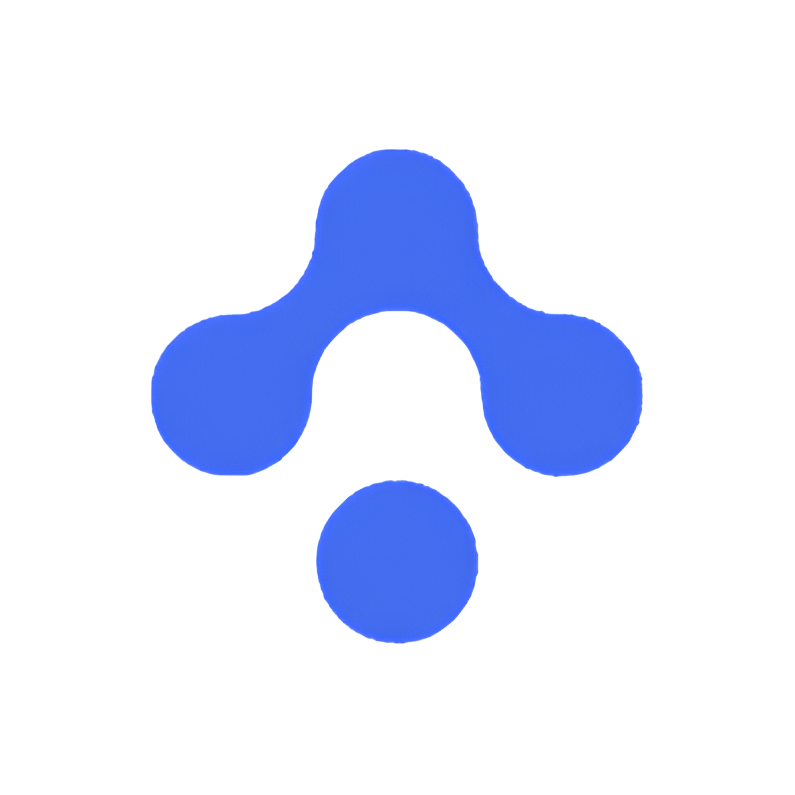

# WavePass 👋 - Modern Attendance Tracking for Schools

  

**Streamline your school's employee attendance with ease and precision. WavePass is an intuitive, cloud-based system designed to save time, improve accuracy, and enhance safety.**

---

## ✨ Features & Advantages

WavePass offers a comprehensive suite of features to simplify attendance management:

*   ⏱️ **Real-Time Tracking:** Monitor employee presence instantly. Get live updates and notifications, ensuring you're always informed.
*   📊 **Detailed Reporting:** Generate comprehensive attendance reports for individuals, departments, or the entire institution. Gain valuable insights with ease.
*   📱 **Responsive & Accessible:** Employees can check in/out from any device, including desktops, tablets, and smartphones. Administrators can manage the system on the go.
*   🔒 **Secure Access & Data:** Role-based permissions and robust security measures ensure your data is safe, private, and compliant.
*   💳 **RFID Integration:** Seamlessly integrate with RFID card systems for quick and effortless check-ins.
*   ☁️ **Cloud-Based Convenience:** Access your attendance data anytime, anywhere. No complex installations or server maintenance required.
*   ⚙️ **Customizable Settings:** Adapt attendance rules, work schedules, and reporting formats to perfectly match your institution's policies.
*   💡 **Intuitive Interface:** Designed with user-friendliness in mind, ensuring a smooth experience for both administrators and staff.
*   ⏳ **Time-Saving Automation:** Reduce manual data entry and administrative overhead, freeing up valuable time for educators.
*   🎯 **Improved Accuracy:** Minimize errors associated with manual tracking, leading to more reliable attendance records.

---

## 🚀 How It Works (Usage)

Getting started with WavePass is simple:

1.  **📝 Set Up Your Account:**
    Register your institution and create administrator accounts in minutes through our simple onboarding process.

2.  **👥 Import Employee Data:**
    Easily upload your existing employee records via CSV or add them manually using our intuitive interface.

3.  **🛠️ Configure Your Settings:**
    Customize attendance rules, work schedules, and reporting preferences to align with your school's specific needs.

4.  **✅ Start Tracking:**
    Employees can begin recording their attendance effortlessly using RFID cards or through our secure web interface. Administrators can monitor and manage everything in real-time.

---

## 🌟 Why Choose WavePass?

In a world that demands efficiency and reliability, WavePass stands out as the ideal attendance solution for educational institutions. Here’s why:

*   **🎯 Designed for Education:**
    We understand the unique needs of schools. WavePass is tailored to address the specific challenges faced by educational environments, not a generic business tool.

*   **😌 Simplicity & Ease of Use:**
    We believe powerful software doesn't have to be complicated. Our intuitive design ensures that administrators and staff can use WavePass effectively with minimal training.

*   **🛡️ Reliability & Security First:**
    Your data's security and the system's reliability are our top priorities. We employ industry-standard security practices to protect sensitive information and ensure consistent uptime.

*   **📈 Efficiency & Accuracy:**
    Move beyond manual spreadsheets and outdated systems. WavePass automates attendance tracking, reducing errors, saving significant administrative time, and providing accurate data for payroll and compliance.

*   **🤝 Dedicated Support (Future Goal):**
    We are committed to providing excellent support to our users. As we grow, we aim to offer prompt and helpful assistance to ensure you get the most out of WavePass. *(You can adjust this based on your current support capacity)*

*   **💡 Innovative & Forward-Thinking:**
    We are constantly looking for ways to improve and add features that bring real value to schools, leveraging modern technology like RFID and cloud computing.

**WavePass isn't just an attendance system; it's a partner in optimizing your school's operational efficiency and fostering a more secure and organized environment.**

---

  Copyright © 2024 Pavel Bureš, Kryštof Topinka, Filip Elznic. All Rights Reserved.

*Thank you for considering WavePass!*
